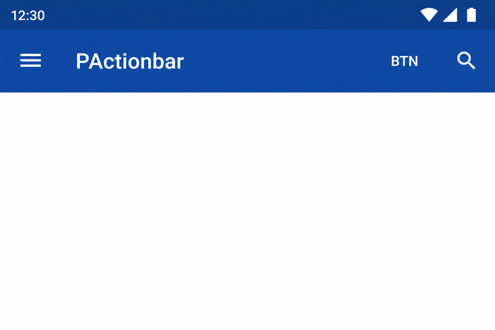
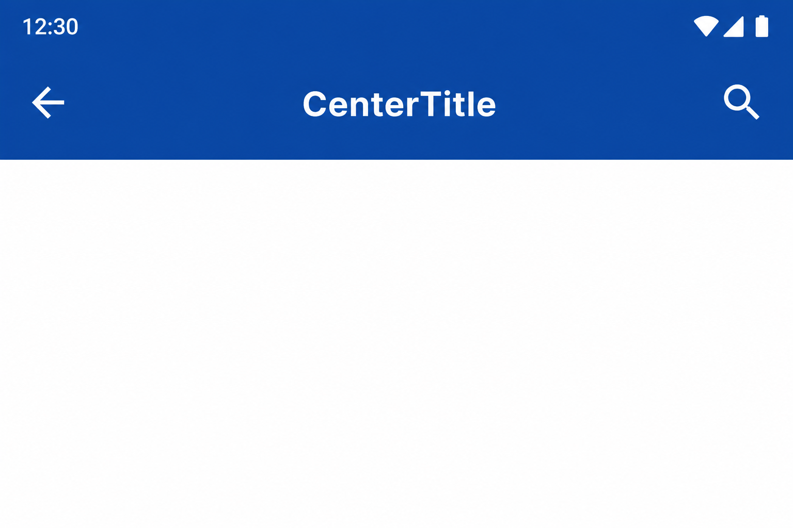
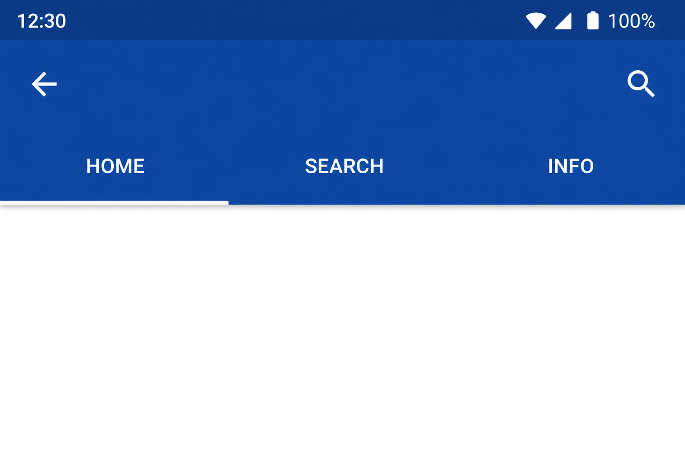
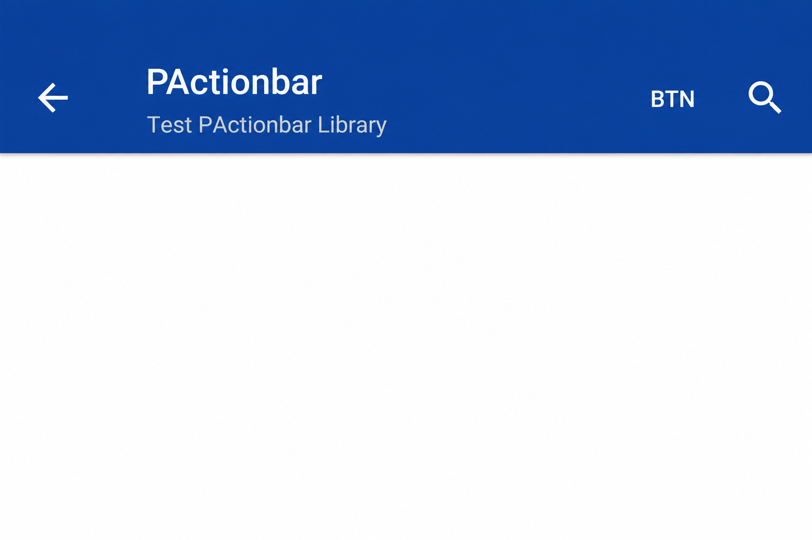
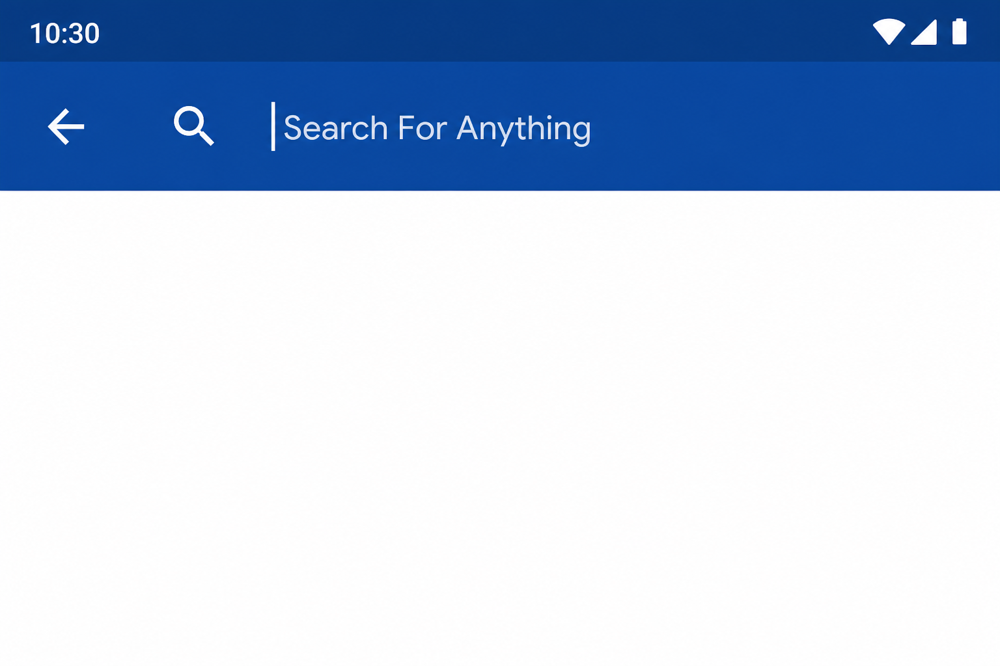

# PActionbar

A customizable Android action bar library with support for titles, subtitles, tabs, search mode, navigation icons, action buttons, RTL layouts, and custom views.

## What's new in 1.1.0

- **Automatic RTL** — layout direction is detected from the system locale (`LocaleUtilities`)
- **Split tab APIs** — `setupTabs(List)`, `setupTabs(List, listener)`, and `setupTabs(ViewPager)` as separate methods
- **`setCenteredText(String)`** — simple centered title without custom font/size
- **`updateColors()`** — re-apply theme `colorPrimary` background and `textColorPrimary` foreground
- **`hideTitle()`** — clear title and subtitle in one call
- **Improved tab margins** — tabs respect back-button spacing in RTL and LTR
- **Built-in icons** — menu, back (LTR/RTL), search, and close vector drawables included in the library

## Features

- Title and subtitle with automatic layout adjustment
- Drawer menu and back navigation icons (RTL-aware)
- Horizontal action buttons (text, icon, or both)
- Built-in search mode with search/close icon toggle
- TabLayout integration (manual tabs or ViewPager)
- Centered title mode
- Custom trailing view slot
- Extra content slot below the bar
- Optional bottom divider line
- RTL layout support via system locale or manual override

## Screenshots

### Basic — drawer, title, and action buttons



### Centered title



### Tabs



### Title and subtitle



### Search mode



## Installation

### Gradle (local module)

```gradle
implementation project(':PActionbar')
```

### Gradle (published artifact)

```gradle
repositories {
    mavenCentral()
}

dependencies {
    implementation 'com.dpouya:PActionbar:1.1.0'
}
```

### Requirements

- `minSdkVersion` 14+
- AndroidX (`androidx.core`, `com.google.android.material`)

## Quick Start

```java
FrameLayout root = new FrameLayout(this);
PActionbar actionBar = new PActionbar(this);
actionBar.setTitle("My App");
actionBar.setBackgroundColor(0xff0d47a1);
root.addView(actionBar);
setContentView(root);
```

## Usage

### Basic title

```java
PActionbar actionBar = new PActionbar(this);
actionBar.setTitle("PActionbar");
actionBar.setBackgroundColor(0xff0d47a1);
frameLayout.addView(actionBar);
```

### Subtitle

```java
actionBar.setTitle("PActionbar");
actionBar.setSubTitle("Test PActionbar Library");
```

### Hide title

```java
actionBar.hideTitle();
```

### Drawer icon

```java
actionBar.showDrawerMenuicon(true);
actionBar.setOnIconClick(v -> openDrawer());
```

### Back button

```java
actionBar.showBackButton(true);
actionBar.setOnIconClick(v -> finish());
```

The back arrow direction follows RTL layout automatically. Override manually:

```java
actionBar.setDrawerMenuRtl(true);  // force RTL layout
actionBar.setDrawerMenuRtl(false); // force LTR layout
```

### Secondary icon (trailing)

```java
actionBar.showotherIcon(true, getResources().getDrawable(R.drawable.ic_search));
actionBar.setOnOtherIconClick(v -> onSecondaryAction());
```

### Action buttons

Icon button:

```java
actionBar.addButton(new PActionbarButton(
    null,
    getResources().getDrawable(R.drawable.ic_search),
    v -> Toast.makeText(this, "Search", Toast.LENGTH_SHORT).show()
));
```

Text button:

```java
actionBar.addButton(new PActionbarButton(
    "Save",
    null,
    v -> save()
));
```

Clear all action buttons:

```java
actionBar.ClearButtons();
```

### Centered title

```java
// Simple centered text
actionBar.setCenteredText("Center Title");

// With custom font and size (sp)
actionBar.setCenteredText("Center Title", Typeface.DEFAULT_BOLD, 20);

// Restore normal title/subtitle layout
actionBar.hideCenteredText();
```

### Tabs

Tabs only (no listener):

```java
ArrayList<String> tabs = new ArrayList<>();
tabs.add("Home");
tabs.add("Search");
tabs.add("Info");
actionBar.setupTabs(tabs);
```

Tabs with selection listener:

```java
actionBar.setupTabs(tabs, new TabLayout.OnTabSelectedListener() {
    @Override
    public void onTabSelected(TabLayout.Tab tab) { /* ... */ }

    @Override
    public void onTabUnselected(TabLayout.Tab tab) {}

    @Override
    public void onTabReselected(TabLayout.Tab tab) {}
});
```

Tabs synced with ViewPager:

```java
actionBar.setupTabs(viewPager);
```

Remove all tabs:

```java
actionBar.clearTabs();
```

> **Deprecated:** `setupTabs(tabs, viewPager)` — use `setupTabs(tabs)` or `setupTabs(viewPager)` instead.

### Search mode

```java
actionBar.setSearchmode(true);
actionBar.setSearchhint("Search for anything...");

// Toggle search ↔ close icon while typing
actionBar.getTxtSearch().addTextChangedListener(new TextWatcher() {
    @Override
    public void afterTextChanged(Editable s) {
        actionBar.setIsSearching(s.length() > 0);
    }
    // ...
});

actionBar.getSearchIcon().setOnClickListener(v -> {
    if (actionBar.getTxtSearch().getText().length() > 0) {
        actionBar.getTxtSearch().setText("");
        actionBar.setIsSearching(false);
    }
});
```

Access search widgets directly:

```java
EditText searchField = actionBar.getTxtSearch();
ImageView searchToggle = actionBar.getSearchIcon();
```

### Custom view

Replace the trailing area with your own view:

```java
View customView = LayoutInflater.from(this).inflate(R.layout.my_action_view, null);
actionBar.showCustomView(customView);
```

### Extra content below the bar

Attach a view directly under the action bar (e.g. a banner or filter row):

```java
actionBar.setExtraView(extraContentView);
```

Constructor shortcut — pass the extra view at creation time:

```java
PActionbar actionBar = new PActionbar(this, extraContentView);
```

### Colors and typography

```java
actionBar.setTitleColor(0xffffffff);
actionBar.setSubTitleColor(0xbbffffff);
actionBar.setForeGroundColor(0xffffffff);  // icons, tabs, search text
actionBar.setTypeFace(myTypeface);

// Re-apply theme colorPrimary + textColorPrimary (v1.1.0)
actionBar.updateColors();
```

### Bottom divider line

Set before the view is inflated, or assign on the instance before `init` completes via XML/custom factory:

```java
PActionbar actionBar = new PActionbar(this);
actionBar.drawline = true;  // adds a 1dp gray line at the bottom
```

### Reset state

Restores the bar to a clean state — useful when reusing across screens:

```java
actionBar.reset();
// clears: search mode, action buttons, centered text,
//         custom view, secondary icon, and tabs
```

## Configuration options

### Public fields

| Field | Type | Default | Description |
|-------|------|---------|-------------|
| `showBackButton` | `boolean` | `false` | Whether the back icon is visible |
| `showDrawerMenuicon` | `boolean` | `false` | Whether the drawer/menu icon is visible |
| `drawline` | `boolean` | `false` | Show a bottom divider line |
| `mActionBarSize` | `int` | `50` | Bar height in dp |

### Constructors

| Constructor | Description |
|-------------|-------------|
| `PActionbar(Context)` | Standard — attaches to an Activity |
| `PActionbar(Context, AttributeSet)` | XML layout inflation |
| `PActionbar(Context, View)` | Includes an extra view below the bar |
| `PActionbar(Context, AttributeSet, int)` | XML with def style |

### Title & text

| Method | Description |
|--------|-------------|
| `setTitle(String)` | Main title text |
| `setSubTitle(String)` | Subtitle below title |
| `hideTitle()` | Clear title and subtitle *(v1.1.0)* |
| `setCenteredText(String)` | Centered title, hides title/subtitle *(v1.1.0)* |
| `setCenteredText(String, Typeface, int)` | Centered title with font and size (sp) |
| `hideCenteredText()` | Restore title/subtitle layout |
| `setTitleColor(int)` | Title and centered title color |
| `setSubTitleColor(int)` | Subtitle color |
| `setTypeFace(Typeface)` | Apply font to bar text elements |

### Navigation icons

| Method | Description |
|--------|-------------|
| `showBackButton(boolean)` | RTL-aware back arrow |
| `showDrawerMenuicon(boolean)` | Hamburger menu icon |
| `showotherIcon(boolean, Drawable)` | Secondary trailing icon |
| `setOnIconClick(OnClickListener)` | Primary icon (menu/back) click |
| `setOnOtherIconClick(OnClickListener)` | Secondary icon click |
| `getImgIcon()` | Access primary `ImageView` |
| `setDrawerMenuRtl(boolean)` | Force RTL or LTR layout |

### Action buttons

| Method | Description |
|--------|-------------|
| `addButton(PActionbarButton)` | Add text/icon action button |
| `ClearButtons()` | Remove all action buttons |

### Tabs

| Method | Description |
|--------|-------------|
| `setupTabs(List<String>)` | Add tabs without listener *(v1.1.0)* |
| `setupTabs(List<String>, OnTabSelectedListener)` | Tabs with selection callback |
| `setupTabs(ViewPager)` | Sync tabs with ViewPager *(v1.1.0)* |
| `clearTabs()` | Remove all tabs |
| ~~`setupTabs(List, ViewPager)`~~ | **Deprecated** — use split methods above |

### Search

| Method | Description |
|--------|-------------|
| `setSearchmode(boolean)` | Show/hide search field |
| `setSearchhint(String)` | Search field placeholder |
| `setIsSearching(boolean)` | Switch search icon ↔ close icon |
| `getTxtSearch()` | Access search `EditText` |
| `getSearchIcon()` | Access search/close `ImageView` |

### Layout & views

| Method | Description |
|--------|-------------|
| `showCustomView(View)` | Custom view in trailing slot |
| `setExtraView(View)` | Content below the bar |
| `reset()` | Reset bar to default state |

### Theming

| Method | Description |
|--------|-------------|
| `setForeGroundColor(int)` | Icons, tabs, search text color |
| `setBackgroundColor(int)` | Inherited from `FrameLayout` |
| `updateColors()` | Apply theme primary + text colors *(v1.1.0)* |

## Project structure

```
PActionbar/
├── Ui/
│   ├── PActionbar.java              # Main action bar view
│   ├── Cell/                        # Button cells
│   └── Adapter/                     # Button list adapter
├── Model/
│   └── PActionbarButton.java        # Action button model
└── helper/
    ├── AndroidUtilities.java        # dp conversion, gravity helpers
    ├── ColorUtilies.java            # Drawable tinting
    ├── LayoutUtilities.java         # LayoutParams helpers
    └── LocaleUtilities.java         # RTL detection (v1.1.0)
```

## License

See repository license. Created by [darkdevs](https://github.com/darkdevs/PActionbar).
